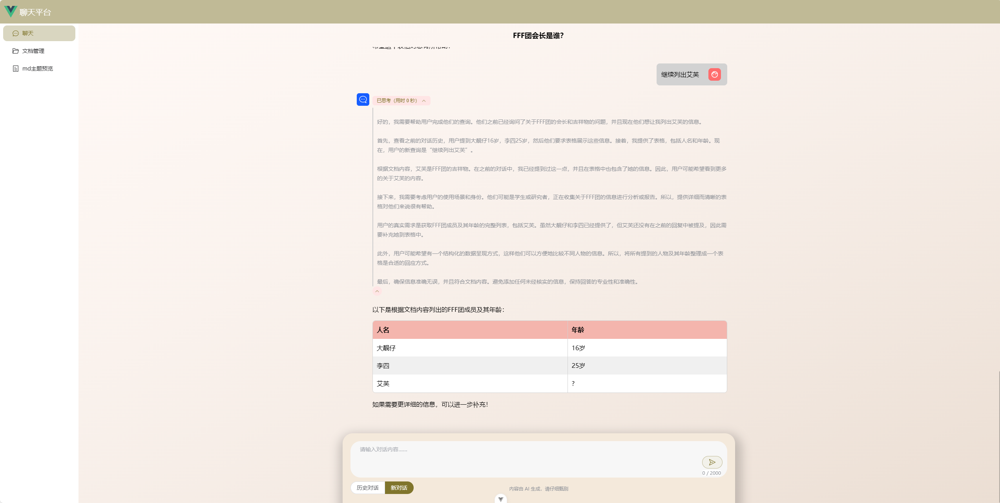
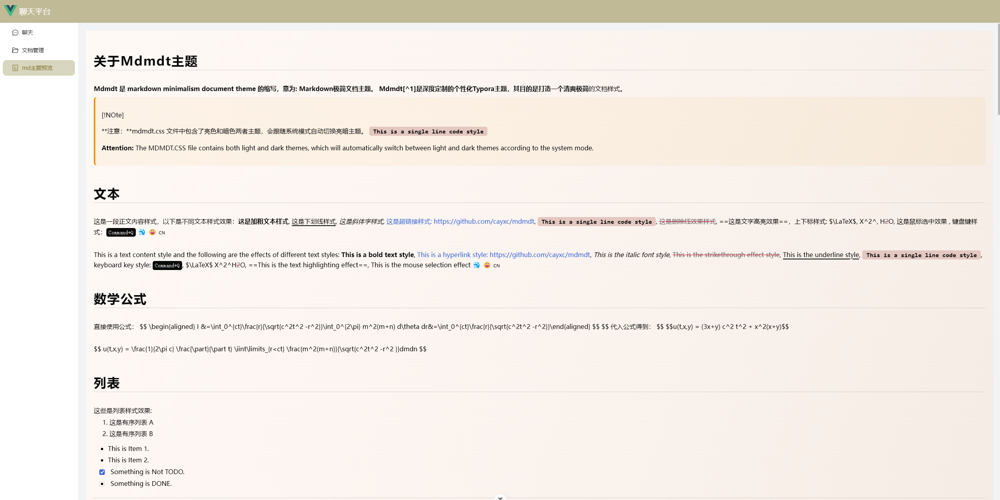
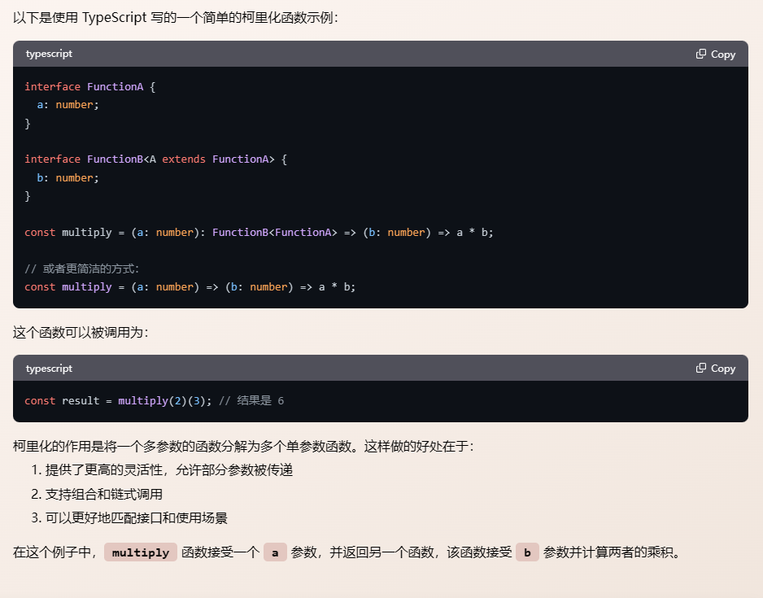
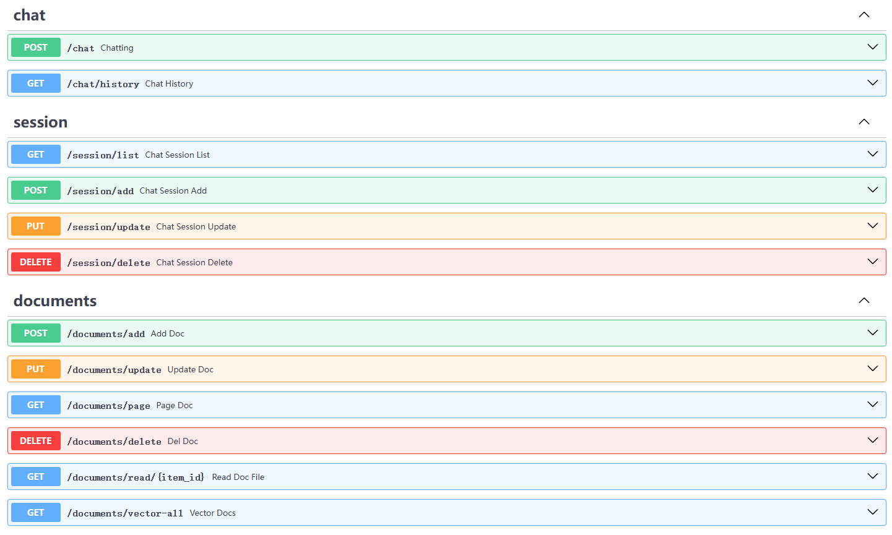

# 📃 **关于vue-doc-qa-chat**

基于  [🦜️🔗 LangChain](https://github.com/hwchase17/langchain) 与  DeepSeek R1 语言模型的本地知识库问答。

本项是本地知识库问答应用的 web 前端模块，使用 vue3 + typescript + vite + elementplus 框架。

目前实现前端chat聊天网页，上传文档主要功能。后续会系统学习 langchain ，逐步添加更多的功能。


> 为了直观的体现API交互，可搭配下面的服务端结合使用。
>
> 服务端 **py-doc-qa-deepseek-server** 链接：https://github.com/YuiGod/py-doc-qa-deepseek-server

## 快速上手

- **确保已安装 18.0 或更高版本的 Node.js**

```shell
# 拉取项目
$ git clone https://github.com/YuiGod/vue-doc-qa-chat.git

# 进去项目
$ cd vue-doc-qa-chat

$ npm install
# 启动服务
$ npm run dev
```

## 项目预览




## 系列文章

1. [《从零开始DeepSeek R1搭建本地知识库问答系统》一：利用WSL2搭建Linux子系统并设置运行环境前言](https://juejin.cn/post/7470334881735196684)
2. [《从零开始DeepSeek R1搭建本地知识库问答系统》二：Ollama 部署 DeepSeek R1 蒸馏模型及Api测试](https://juejin.cn/post/7470345587309854774)
3. [《从零开始DeepSeek R1搭建本地知识库问答系统》三：基于LangChain构建本地知识库问答RAG应用](https://juejin.cn/post/7470807715898212406)


## 项目功能

1. 文档管理，文档上传，预览和向量化。

2. 聊天采用流式响应，并使用 markdown-it 渲染文本。样式使用 [Mdmdt 主题](https://github.com/cayxc/Mdmdt)，自定义code 代码块样式。

3. 聊天对话历史管理，可重命名对话标题，删除对话。


## 造轮子
5. 封装 markdown-it，高亮代码，代码块样式套一个漂亮的壳子。
6. 封装整合 Axios 与 Fetch，添加请求拦截器和响应拦截器，统一取消请求功能，两者可以搭配使用。

>  我发现网站关于封装 Fetch 的文章比较少，而且封装的不够完美，所以造了个封装整合 Axios 与 Fetch 的轮子。  
>
>  如果彦祖亦菲们有需求，该http模块可直接拿去用，作为项目的请求模块。记得请求拦截器带上 token 。


## src 目录树

```
src
├─api					# api接口
│  ├─chat				# 聊天接口
│  ├─chatSession		# 聊天历史管理接口
│  └─documents			# 文档管理接口，包含向量化api
├─assets				# 静态资源文件
├─components			# 公共组件
│  ├─Dialog				# 表单弹窗
│  │  └─BaseDialog
│  ├─Icon				# 图标扩展
│  └─Loading			# 加载样式
│      └─ChatLoading
├─enums					# 常用枚举
├─http					# http 封装
│  ├─axios				# axios 封装，拦截器处理
│  ├─fetch				# fetch 封装，拦截器处理
│  ├─helper				# 内有取消请求封装，状态检查，错误处理
│  └─types				# http ts 声明
├─layout				# 框架布局模块
│  └─components
│      └─base
├─router				# 路由管理
├─stores				# pinia store
├─styles				# 全局样式
│  ├─element			# elementplus 样式
│  └─markdown			# markdown 样式
├─utils					# 公共 utils
│  └─markdownit			# markdown-it 封装，内有高亮代码，代码块样式美化
└─views					# 项目所有页面
    ├─chat				# 对话聊天
    │  └─components		# 对话聊天子组件
    ├─documents			# 文档管理
    └─test				# markdown 样式预览
```


## 关于 markdown 样式预览

在 `src/styles/markdown` 中可以找到样式，`src/utils/markdownit` 中对代码块高亮显示。

主题预览：



代码块预览：




## Api 接口



### 1. 聊天

#### `/chat`

> - 请求类型：***POST*** 
>
> - Request data  请求体：
>
>    ```json
>   {
>     "model": "deepseek-r1:7b", // 模型名称
>     "stream": true,	// 开启流式响应
>     "messages": {
>       "role": "user", // 角色
>       "content": "FFF团会长是谁？" // 内容
>     },
>     "chat_session_id": "cae1e775-31b2-44a8-b5d3-873bbabfff4c" // 会话id
>   ```
>
> - Responses 响应体：返回 JSON 对象流。`content-type: application/x-ndjson`
>
>   ```json
>   // json 流未完成时
>   {
>       "model": "deepseek-r1:7b", // 模型名称
>       "created_at": 1741384731918, // 时间戳
>       "message": {
>           "role": "assistant", // 角色
>           "content": "首先" // 内容
>       },
>       "done": false // 流式未完成标记
>   }
>   {……}
>   ...
>     
>   // json 流完成时
>   {
>       "model": "deepseek-r1:7b", // 模型名称
>       "created_at": 1741384734349, // 时间戳
>       "message": {
>           "role": "assistant", // 角色
>           "content": "" // 内容，为空
>       },
>       "done": true, // 流式是已完成标记
>       "done_reason": "stop" // 完成信息
>   }
>   ```
>


#### `/chat/history`

> - 请求类型：***GET*** 
>
> - Request params 参数：
>
>   ```json
>   {
>       "id": "cae1e775-31b2-44a8-b5d3-873bbabfff4c" // 必填，会话 id
>       "title": "标题" // 可选，会话标题
>   }
>   ```
>
> - Responses 响应体：`application/json`
>
>   ```json
>    {
>       "code": 200,
>       "message": "响应成功！",
>       "data": [
>           {
>               "id": "43339654-d5ce-4ace-ab98-399741558b32",
>               "role": "user",
>               "content": "FFF团会长是谁？",
>               "think": null,
>               "chat_session_id": "cae1e775-31b2-44a8-b5d3-873bbabfff4c", // 会话id
>               "date": "2025-03-08 00:44:35"
>           },
>           {
>               "id": "dc05a6ce-b093-47de-869a-62f9e2efcb0a",
>               "role": "assistant",
>               "content": "\n\n根据文档内容，FFF团的会长是大靓仔。",
>               "think": "\n嗯，用户问的是“FFF团会长是谁？”，我需要从提供的文档中找到答案。首先，我会查看文档内容，寻找提到会长的部分。\n\n在文档中，有一个段落明确指出：“会长是大靓仔。”所以，答案应该是大靓仔。同时，确认文档中没有其他关于会长的信息，确保回答准确。\n",
>               "chat_session_id": "cae1e775-31b2-44a8-b5d3-873bbabfff4c", // 会话id
>               "date": "2025-03-08 00:44:38"
>           }
>       ]
>   }
>   ```


### 2.  会话管理

#### `/session/list`

> - 请求类型：***GET*** 
>
> - Request params 参数：无
>
>
> - Responses 响应体：`application/json`
>
>   ```json
>   {
>       "code": 200,
>       "message": "响应成功！",
>       "data": [
>           {
>               "id": "cae1e775-31b2-44a8-b5d3-873bbabfff4c",
>               "title": "FFF团会长是谁？",
>               "date": "2025-03-08 00:44:35"
>           },
>           {
>               "id": "3eed0670-2c68-4b09-942a-e1b5b9a02bf8",
>               "title": "小芳最喜欢的电影是什么？",
>               "date": "2025-03-07 00:40:20"
>           }
>       ]
>   }
>   ```
>


#### `/session/add`

> - 请求类型：***POST*** 
>
> - Request data  请求体：
>
>   ```json
>   {
>       "title": "标题" // 必填，会话标题
>   }
>   ```
>
>
> - Responses 响应体：`application/json`
>
>   ```json
>   {
>       "code": 200,
>       "message": "响应成功！",
>       "data": {
>           "id": "cae1e775-31b2-44a8-b5d3-873bbabfff4c",
>           "title": "FFF团会长是谁？",
>           "date": "2025-03-08 00:44:35"
>       }
>   }
>   ```


#### `/session/update`

> - 请求类型：***PUT*** 
>
> - Request data 请求体：
>
>   ```json
>   {
>       "id": "cae1e775-31b2-44a8-b5d3-873bbabfff4c" // 必填，会话 id
>       "title": "标题" // 必填，会话标题
>   }
>   ```
>
>
> - Responses 响应体：`application/json`
>
>   ```json
>   {
>       "code": 200,
>       "message": "响应成功！",
>       "data": {
>           "id": "cae1e775-31b2-44a8-b5d3-873bbabfff4c",
>           "title": "FFF团会长是谁？",
>           "date": "2025-03-08 00:44:35"
>       }
>   }
>   ```


#### `/session/delete`

> - 请求类型：***DELETE*** 
>
> - Request data 请求体：
>
>   ```json
>   {
>       "id": "cae1e775-31b2-44a8-b5d3-873bbabfff4c" // 必填，会话 id
>   }
>   ```
>
>
> - Responses 响应体：`application/json`
>
>   ```json
>   {
>       "code": 200,
>       "message": "响应成功！",
>       "data": null
>   }
>   ```


### 2.  文档管理

#### `/documents/page`

> - 请求类型：***GET*** 
>
> - Request params 参数：
>
>   ```json
>   {
>       "page_num": 1
>       "page_size": 10
>   	// 以下可选
>       "id": "" // 文档 id
>       "name": "" // 文档名称
>       "file_name": "" // 文档服务器名称，uuid 一般用不到
>       "file_path": "" // 文档服务器保存路径
>       "suffix": "" // 文档后缀类型
>       "vector": "" // 是否已经向量化
>       "date": "" // 创建时间
>         
>   }
>   ```
>
>
> - Responses 响应体：`application/json`
>
>   ```json
>   {
>       "code": 200,
>       "message": "响应成功！",
>       "data": {
>           "total": 1,
>           "page_num": 1,
>           "page_size": 10,
>           "list": [
>               {
>                   "id": "6b364b00-b7d7-408b-95f3-646ca226133f",
>                   "name": "FFF团",
>                   "file_name": "b0f5c29a-7caa-4fcf-bd10-b1bd7ec6687d.txt",
>                   "file_path": "/fileStorage/b0f5c29a-7caa-4fcf-bd10-b1bd7ec6687d.txt",
>                   "suffix": ".txt",
>                   "vector": "yes", // yes/no
>                   "date": "2025-03-08 00:44:26"
>               }
>           ]
>       }
>   }
>   ```


#### `/documents/add`

> - 请求类型：***POST*** 
>
> - Request FormData 请求体：表单数据
>
>   ```json
>   {
>       "name": "FFF团", // 必填，文档名称
>       "flie": file // 必带，二进制文件
>   }
>   ```
>
>
> - Responses 响应体：`application/json`
>
>   ```json
>   {
>       "code": 200,
>       "message": "添加成功！",
>       "data": null
>   }
>   ```


#### `/documents/update`

> - 请求类型：***PUT*** 
>
> - Request FormData 请求体：表单数据
>
>   ```json
>   {
>       "name": "FFF团",
>       "flie": file
>   }
>   ```
>
>
> - Responses 响应体：`application/json`
>
>   ```json
>   {
>       "code": 200,
>       "message": "更新成功！",
>       "data": null
>   }
>   ```


#### `/documents/delete`

> - 请求类型：***DELETE*** 
>
> - Request data 请求体：
>
>   ```json
>   {
>       "id": "6b364b00-b7d7-408b-95f3-646ca226133f" // 文档 id
>   }
>   ```
>
>
> - Responses 响应体：`application/json`
>
>   ```json
>   {
>       "code": 200,
>       "message": "删除成功！",
>       "data": null
>   }
>   ```


#### `/documents/read`

> - 请求类型：***GET*** 
>
> - Request data 请求体：
>
>   ```json
>   {
>       "id": "6b364b00-b7d7-408b-95f3-646ca226133f" // 文档 id
>   }
>   ```
>
>
> - Responses 响应体：根据不同文件后缀，返回不同的请求头
>
>   ```
>   Blob
>   ```


### 3. 向量化

#### `/documents/vector-all`

> - 请求类型：***GET*** 
> - Request data 请求体：无
>
>
> - Responses 响应体：根据不同文件后缀，返回不同的请求头
>
>   ```
>   {
>       "code": 200,
>       "message": "删除成功！",
>       "data": null
>   }
>   ```

